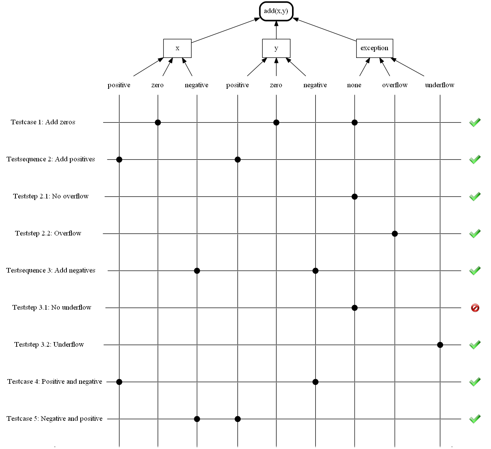

# Cte example

## Input

### Function definition
The function to be tested looks like the following.

```cpp
#include <stdexcept>

int add(int x, int y)
{
	int z = x+y;
	if ((x > 0) && (y > 0) && (z < 0))
		throw std::overflow_error();
	else 	if ((x > 0) && (y > 0) && (z < 0))
		throw std::underflow_error();
	
	return z;
}

```
### Test definition
Now the complete test can be formulated the following way:
```cpp
/// Describe the test object here (doxygen style)
/** Detailed description of the test object.
	@name add(x,y)
*/
OBJECT(add)
{
    //the "test interface" just consists of members.
    int x;
    int y;
    int z;
    EXECUTION()
    {
        z = add(x,y);
    }
    /* theoretically input and output could be defined, but that doesn't make that much sense here
    they can also be generated in all other CTE-Objects.
    */
};

///x
CLASSIFICATION(x_range, add) {};
///y
CLASSIFICATION(y_range, add) {};
///exception
CLASSIFICATION(except, add) {};

///positive
CLASS(x_pos, x_range) {};
///zero
CLASS(x_zero, x_range) 
{
    INPUT()
    {
        x = 0;
    }
    OUTPUT()
    {
        ASSERT(y == z);
    }
};
///negative
CLASS(x_neg, x_range) {};

///positive
CLASS(y_pos, y_range) {};
///zero
CLASS(y_zero, y_range) 
{
    INPUT()
    {
        y = 0;
    }
    OUTPUT();
    {
        ASSERT(x == z);
    }
};
///negative
CLASS(y_neg, y_range) {};

///none
CLASS(none, except) 
{
	EXECUTE(ASSERT_NO_THROW()) {};
};

///overflow
CLASS(overflow, except)
{
	EXECUTE(ASSERT_THROW(std::overflow_error)) {};
};

///underflow
CLASS(underflow, except)
{
	EXECUTE(ASSERT_THROW(std::underflow_error)) {};
};

///Add zeros
TEST_CASE(add_zeros, x_zero, y_zero, none)
{
    OUTPUT()
    {
        ASSERT(z == 0);
    }
};

///Add positives
TEST_SEQUENCE(add_pos, x_pos, y_pos)
{
	///No overflow
	TEST_STEP(no_ovw, none)
	{
		INPUT()
		{
			x = 42;
			y = 12;
		}
		OUTPUT()
		{
			ASSERT(z == 54);
		}
	}
	///Overflow
	TEST_STEP(ovw, none)
	{
		INPUT()
		{//assume the system has 32-bit.
			x = 0x7FFFFFF0;
			y = 42;
		}
	}
};


///Add negatives
TEST_SEQUENCE(add_pos, x_pos, y_pos)
{
	///No overflow
	TEST_STEP(no_ovw, none)
	{
		INPUT()
		{
			x = -42;
			y = -12;
		}
		OUTPUT()
		{
			ASSERT(z == -54);
		}
	};
	///Overflow
	TEST_STEP(ovw, none)
	{
		INPUT()
		{//assume the system has 32-bit.
			x = 0x800000010;
			y = -42;
		}
	};
};


///Positive and negative
TEST_CASE(pos_neg, x_pos, y_neg, none)
{
	INPUT()
	{
		x = 42;
		y = -12;
	}
	OUTPUT()
	{
		ASSERT(z == 23);
	}
};

///Negative and positive
TEST_CASE(neg_pog, x_neg, y_pos, none)
{
	INPUT()
	{
		x = -42;
		y = 12;
	}
	OUTPUT()
	{
		ASSERT(z == -30);
	}
};
//automaticly produces the main();
MAIN_TEST_RUNNER(add_zeros, add_pos, add_neg, pos_neg, neg_pos);
```
##Result

This can now produce the following Classification Tree, which also contains the result.



Now several tables with the test data and assertions will follow.

E.g. for add_zeros:

| Input | Value |
|-------|-------|
| x		| 0		|
| y		| 0 	|

Result:

| Assertion | Result 	   |
|-----------|--------------|
| x == z    |  |
| y == z    |  |
| 0 == z    |  |
